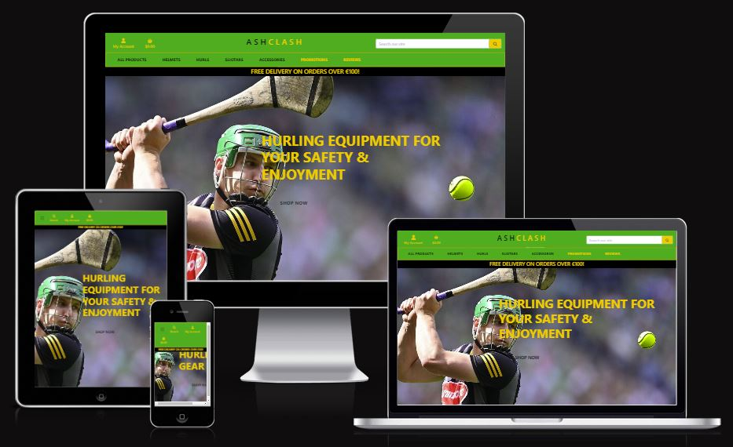

# AshClash

### A website selling helmets hurls and sliotars to those interested in the great game of hurling.



Portfolio 5 project as part of the Diploma in Full Stack Software Development by Code Institute.
___

Welcome to AshClash, your one-stop destination for all things hurling! At AshClash, we're passionate about the great game of hurling, and we're dedicated to providing enthusiasts and newcomers alike with top-quality helmets, hurls, and sliotars. Whether you're a seasoned player looking to upgrade your gear or a parent eager to introduce your child to the excitement of hurling from an early age, AshClash has you covered. Our online store offers a diverse selection of equipment designed to meet the needs of players of all ages and skill levels. Explore our collection today and gear up for your next hurling adventure with AshClash!

Link to live site - []()

## CONTENTS

- [AshClash](#AshClash)
  - [CONTENTS](#contents)
  - [Site Objectives](#site-objectives)
- [User Experience/UX](#user-experienceux)
  - [Target Audience](#target-audience)
  - [User Stories](#user-stories)
    - [New Visitor Goals](#new-visitor-goals)
    - [Existing Visitor Goals](#existing-visitor-goals)
- [Design Choices](#design-choices)
  - [Colour Scheme](#colour-scheme)
  - [Typography](#typography)
  - [Logo and Favicon](#logo-and-favicon)
  - [Wireframes](#wireframes)
  - [Flow Diagram](#flow-diagram)
  - [Database Plan](#database-plan)
- [Features](#features)
  - [Registration](#registration)
  - [Future Features](#future-features)
  - [Features Not Included](#features-not-included)
- [Technologies Used](#technologies-used)
- [Programming Languages, Frameworks and Libraries Used](#programming-languages-frameworks-and-libraries-used)
- [Agile](#agile)
- [Testing](#testing)
  - [Manual Testing](#manual-testing)
  - [User](#user)
  - [Bugs](#bugs)
  - [Lighthouse](#lighthouse)
  - [Validation Testing](#validation-testing)
    - [HTML \& CSS](#html--css)
  - [Python Testing](#python-testing)
  - [Deployment](#deployment)
    - [Github Deployment](#github-deployment)
    - [Creating a Fork or Copying](#creating-a-fork-or-copying)
    - [Clone](#clone)
    - [Repository deployment via Heroku](#repository-deployment-via-heroku)
    - [Deployment of the app](#deployment-of-the-app)
  - [Credits](#credits)
  - [Media](#media)
  - [Acknowledgments and Thanks](#acknowledgments-and-thanks)

___

## Site Objectives
At AshClash, our primary objective is to foster a thriving community around the sport of hurling while providing easy access to high-quality equipment for players of all ages. Our website serves as a hub for hurling enthusiasts, offering a platform where they can not only purchase essential gear but also connect with fellow players, coaches, and fans. Our three main goals are:

Three main objectives of the AshClash webite are:

- ### Accessibility:
  We aim to make hurling more accessible to individuals of all backgrounds by providing a convenient online platform where players can easily purchase equipment from anywhere in the world.

- ### Quality:
  We are committed to offering only the highest quality helmets, hurls, and sliotars to ensure the safety and enjoyment of our customers as they engage in the exhilarating sport of hurling.

- ### Community Building:
   Beyond being a marketplace, we strive to build a vibrant community around hurling, fostering connections and sharing resources to support players at every stage of their journey, from beginners to seasoned athletes.
___

# User Experience/UX

## Target Audience
    At AshClash, we cater to a diverse range of demographics united by their passion for hurling. Our focus groups include:

- Hurling Enthusiasts:
     This group comprises individuals of all ages who are deeply passionate about the sport of hurling. They may be active players, coaches, or dedicated fans who follow hurling closely and seek high-quality equipment to enhance their performance and enjoyment of the game.

- Parents and Guardians:
     Another key demographic is parents and guardians who are interested in introducing their children to hurling from an early age. They seek safe and reliable equipment for their young players as they embark on their hurling journey, and they rely on AshClash to provide them with suitable gear and guidance.

- Coaches and Clubs:
     Finally, we serve coaches and hurling clubs who are responsible for nurturing and developing players at various levels. They turn to AshClash for bulk purchases of equipment to outfit their teams, ensuring that players have access to the necessary gear to excel in training and competition. Our website also serves as a valuable resource for coaches, offering tips, tutorials, and community support to enhance their coaching endeavors.

## User Goals

### New Visitor Goals
As a new visitor to AshClash, my goal is to explore the website and learn about the range of hurling equipment available. I want to understand the benefits of different gear options and find guidance on selecting the right equipment for my needs. Ultimately, I aim to make an informed purchase that will enhance my experience as I engage with the sport of hurling.

### Existing Visitor Goals
As an existing visitor to AshClash, my goal is to easily navigate the website to find specific products or information I need. Whether I'm looking to replenish my supply of sliotars or seeking advice on improving my hurling technique, I expect a seamless browsing experience that caters to my ongoing involvement in the sport.

### Hurling Enthusiasts' Goals:
As a passionate hurling enthusiast, my goal is to access top-quality equipment that enhances my performance and safety on the field. I seek a wide selection of helmets, hurls, and sliotars, along with expert guidance on choosing the right gear for my playing style and skill level. Additionally, I value a supportive community where I can connect with fellow enthusiasts to share experiences and celebrate our love for the sport.

### Parents & Guardians' Goals:
As a parent or guardian interested in introducing my child to hurling, my goal is to find suitable equipment that prioritizes safety and ease of use. I rely on AshClash to provide me with high-quality helmets, hurls, and sliotars specifically designed for young players. I also appreciate resources and recommendations for nurturing my child's interest in hurling and ensuring a positive and enjoyable experience for them.

### Coaches and Clubs' Goals:
As a coach or representative of a hurling club, my goal is to efficiently source bulk quantities of equipment to outfit my team for training and competition. I require a reliable supplier like AshClash that offers high-quality gear at competitive prices, with options for customization to suit the needs of my players. Additionally, I seek access to educational resources and community support to enhance my coaching effectiveness and foster a strong team dynamic.

## User stories
## As Admin
### Managing Player Profiles:
  * As an admin, I want to be able to view a list of all player profiles registered on the AshClash platform.
  * As an admin, I want to be able to add new player profiles, including details such as name, age, position, skill level, and contact information.
  * As an admin, I want to be able to edit existing player profiles to update information as needed.
  * As an admin, I want to be able to delete player profiles that are no longer active or relevant.
### Managing Equipment Listings:
  * As an admin, I want to be able to view a list of all equipment listings available for purchase on the AshClash website.
  * As an admin, I want to be able to add new equipment listings, including details such as name, description, category, price, and availability.
  * As an admin, I want to be able to edit existing equipment listings to update information or adjust availability status.
  * As an admin, I want to be able to delete equipment listings that are no longer in stock or offered for sale.
### Creating Equipment Recommendations:
  * As an admin, I want to be able to create blog posts and recommendations for popular equipment sold on AshClash.
  * As an admin, I want to be able to add new equipment recommendations, including details such as title, content, author, and associated equipment.
  * As an admin, I want to be able to edit existing equipment recommendations to update content or revise recommendations.
  * As an admin, I want to be able to delete equipment recommendations that are outdated or no longer relevant.

## As a site user
### User Account Management:
  * As a site user, I can create or edit my account to update my details as needed.
### Order Management:
  * As a site user, I can log in to view my order history.
### Product Discovery:
  * As a site user, I can search for products and browse through them to find specific items I'm interested in purchasing.
  * As a site user, I can sort products by criteria such as price and category to easily find what I'm looking for.
### Product Interaction:
  * As a site user, I can view product details to make informed purchase decisions.
  * As a site user, I can easily add products to my shopping basket and view its contents.
  * As a site user, I can update my basket by adding or removing products as needed.
### Checkout Process:
  * As a site user, I can view my order summary and securely checkout to confirm my purchase.
### Engagement:
  * As a site user, I can comment on blog posts to share my opinions.
  * As a site user, I can use the contact form to communicate with the site owners.
### Recommendations:
  * As a site user, I want to easily view recommendations provided by the admin.

# Design Choices

## Color palette

The color palette of AshClash is a homage to the dynamic environment of the hurling field. It draws inspiration from the natural elements that define the sport's essence. Emerald Green embodies the vitality and energy found in the lush grassy fields where hurling matches unfold, while Slate Blue reflects the clear skies above, instilling a sense of focus and determination. Accentuating the palette is Crimson Red, symbolizing the passion and intensity that drive players to excel. Together, these colors evoke the spirit of hurling – resilient, dynamic, and full of heart.


## Typography

The typography of AshClash is carefully selected to complement the energetic and dynamic nature of the sport of hurling. Our primary typeface, a bold and modern sans-serif font, exudes strength and confidence, echoing the power and precision displayed on the hurling field. Its clean lines and distinct letterforms ensure readability across various platforms, from our website to promotional materials. Additionally, we incorporate a secondary typeface, a sleek and versatile serif font, to add a touch of sophistication and balance to our design elements. Together, these typography choices capture the essence of AshClash – bold, dynamic, and ready for action.


## Logo and Favicon

- The logo was created using an online logo creator - [Looka](https://looka.com/)


- The Favicon was created using an online Favicon creator - [Favicon](https://favicon.io/)


## Wireframes

- Homepage Wireframe


- Create Booking Wireframe


- Edit Booking Wireframe


- Delete Booking Wireframe


## Flow Diagram

Here is a diagram showing the possible flow through the site. There are 2 sections shown here. On the left it shows the Admin and the right shows a site user.


## Database Plan

The database plan is fairly simple, but it shows the information that is stored within the database, the type of data and if it is logged as a Primary or Foreign key where applicable.


# Features

## Registration

The user can create an account


The user can logout of an account


## Session booking

The user can book a session with any tutor


The tutor can accept or deny a booked session with a student.


The user can edit previously booked session with tutor.


The user can delete a previously booked session with tutor


## Features not implemented

Comments and reviews have been removed due to lack of time.

## Future Features

### Models

I created a number of models for my project. I used allauth's models for authentication. Here are the other models and their fields:

#### UserProfile

| **PK** | **id** (unique)         | Type         | Notes                |
| ------ | ----------------------- | ------------ | -------------------- |
| **FK** | user                    | OneToOne     | FK to **User** model |
|        | default_phone_number    | CharField    |                      |
|        | default_street_address1 | CharField    |                      |
|        | default_street_address2 | CharField    |                      |
|        | default_town_or_city    | CharField    |                      |
|        | default_county          | CharField    |                      |
|        | default_postcode        | CharField    |                      |
|        | default_country         | CountryField |                      |

#### Promotions

| **PK**  | **id** (unique) | Type          | Notes                        |
| ------- | --------------- | ------------- | ---------------------------- |
| **FK**  | author          | ForeignKey    | FK to **UserProfile** model  |
|         | title           | CharField     | Unique                       |
|         | slug            | SlugField     | Unique                       |
|         | content         | TextField     |                              |
|         | excerpt         | TextField     |                              |
| **M2M** | tags            | ManyToMany    | M2M to **Tag** model         |
| **M2M** | category        | ManyToMany    | M2M to **Category** model    |
| **M2M** | favourited      | ManyToMany    | M2M to **UserProfile** model |
|         | featured_image  | ImageField    |                              |
|         | created_on      | DateTimeField |                              |
|         | updated_on      | DateTimeField |                              |
|         | status          | IntegerField  |                              |

#### Category

| **PK** | **id** (unique) | Type      | Notes  |
| ------ | --------------- | --------- | ------ |
|        | name            | CharField |        |
|        | slug            | SlugField | Unique |

#### Order

| **PK** | **id** (unique) | Type         | Notes                       |
| ------ | --------------- | ------------ | --------------------------- |
|        | order_number    | CharField    |                             |
| **FK** | user_profile    | ForeignKey   | FK to **UserProfile** model |
|        | first_name      | CharField    |                             |
|        | last_name       | CharField    |                             |
|        | email           | EmailField   |                             |
|        | phone_number    | CharField    |                             |
|        | country         | CountryField |                             |
|        | postcode        | CharField    |                             |
|        | town_or_city    | CharField    |                             |
|        | street_address1 | CharField    |                             |
|        | street_address2 | CharField    |                             |
|        | county          | CharField    |                             |
|        | shipping_cost   | DecimalField |                             |
|        | order_subtotal  | DecimalField |                             |
|        | order_total     | DecimalField |                             |
|        | original_cart   | TextField    |                             |
|        | stripe_pid      | CharField    |                             |
|        | order_note      | TextField    |                             |

#### OrderLineItem

| **PK** | **id** (unique) | Type         | Notes                   |
| ------ | --------------- | ------------ | ----------------------- |
| **FK** | order           | ForeignKey   | FK to **Order** model   |
| **FK** | product         | ForeignKey   | FK to **Product** model |
|        | quantity        | IntegerField |                         |
|        | line_item_total | DecimalField |                         |

#### Product

| **PK** | **id** (unique) | Type         | Notes |
| ------ | --------------- | ------------ | ----- |
|        | sku             | CharField    |       |
|        | name            | CharField    |       |
|        | description     | TextField    |       |
|        | price           | DecimalField |       |
|        | image           | ImageField   |       |

#### Review

| **PK** | **id** (unique) | Type       | Notes                   |
| ------ | --------------- | ---------- | ----------------------- |
| **FK** | product         | ForeignKey | FK to **Product** model |
| **FK** | user            | ForeignKey | FK to **User** model    |
|        | title           | CharField  |                         |

## Business Model

AshClash is dedicated to providing high-quality, specialized hurling equipment and accessories. Our product range includes hurls, helmets, sliotars, and various other accessories tailored to meet the unique needs of hurling players. We focus on quality, safety, and performance to ensure our customers receive the best gear available.

Customers:

Individual Players: Amateur and professional hurling players seeking reliable and durable equipment.
Teams and Clubs: Local hurling teams and clubs in need of bulk purchases and customized gear.
Schools and Academies: Educational institutions and training academies looking to equip their students with proper hurling equipment.
Retailers and Distributors: Sports retailers and distributors interested in stocking high-quality hurling gear.

Channels:

Online Store: Our primary sales channel is the AshClash website, where customers can browse and purchase products directly.
Social Media: We utilize platforms like Facebook, Instagram, and Twitter for marketing, customer engagement, and direct sales through integrated shopping features.
Email Marketing: Regular newsletters and promotional emails to keep customers informed about new products, offers, and hurling news.
Partnerships: Collaborations with local hurling clubs, schools, and sports retailers to expand our reach and presence.

Relationships:

Personalized Service: Offering expert advice and recommendations to customers to help them choose the right products.
Customer Support: Providing responsive and helpful customer service through email, chat, and phone support.
Community Engagement: Building a community of hurling enthusiasts through social media, forums, and sponsored events.

Revenue:

Direct Sales: Revenue from selling hurling equipment and accessories through our online store.
Bulk Orders: Discounted bulk sales to teams, clubs, schools, and retailers.
Customizations: Additional revenue from personalized and customized gear for teams and individuals.
Affiliate Marketing: Commission from affiliate links and partnerships with other sports brands.

Key Resources:

Product Inventory: A wide range of high-quality hurling equipment and accessories.
E-commerce Platform: A robust and user-friendly website for online sales.
Supply Chain: Reliable suppliers and manufacturers to ensure product quality and availability.
Marketing Tools: Social media, email marketing, and SEO strategies to drive traffic and sales.
Customer Data: Insights and analytics to understand customer preferences and improve offerings.

Activities:

Product Sourcing: Continuously sourcing and updating our inventory with the latest and best hurling gear.
Marketing and Promotion: Implementing effective marketing campaigns to attract and retain customers.
Customer Service: Providing exceptional support and after-sales service to ensure customer satisfaction.
Order Fulfillment: Efficiently managing inventory, packing, and shipping orders to customers.

Partnerships:

Suppliers and Manufacturers: Establishing strong relationships with reliable suppliers for quality products.
Hurling Clubs and Associations: Partnering with clubs and associations for sponsorships and bulk sales.
Marketing Affiliates: Collaborating with influencers, bloggers, and sports websites for affiliate marketing.
Logistics Providers: Partnering with logistics companies for efficient order delivery.

Cost Structure:

Product Costs: Expenses related to sourcing and manufacturing hurling equipment and accessories.
Operational Costs: Website maintenance, staff salaries, and office expenses.
Marketing Expenses: Costs for digital marketing, advertising, and promotional activities.
Shipping and Handling: Costs associated with packing and delivering orders to customers.
Customer Service: Expenses for providing customer support and handling returns.

AshClash aims to become the go-to destination for hurling enthusiasts by offering a comprehensive range of high-quality equipment and accessories. By focusing on customer satisfaction, continuous product improvement, and effective marketing strategies, AshClash is poised to grow and thrive in the niche market of hurling sports.

### Search Engine Optimisation (SEO) and Marketing

#### Marketing

The site has a number of features to help with SEO and marketing. The site has a promotions page, which allows famous hurling players to promote their favourite gear on the site that will help with SEO. You can [click here to access the promotions page](https://ashclash-pp5-8ef04402753f.herokuapp.com/promotions/promotions/). The promotion posts can be shared on social media to drive traffic to the site.

The site also has a Mailchimp newsletter signup form, which can be used to collect emails for marketing purposes. Newsletter form:

.

The site also has a Facebook business page, which can be used to post content for customers to see, as well as engage with customers through comments and messages. You can [click here to see the AshClash Facebook Page](https://www.facebook.com/profile.php?id=61561113772755). Here is a screenshot of the Facebook Business Page:


#### Keywords

The site has a number of keywords that are used in the content and meta tags to help with SEO. I used the tool [Ubersuggest](https://neilpatel.com/ubersuggest/) to find keywords. I used a combination of short-tail and long-tail keywords and included them in my meta tags. Here are some of the keywords I used:

Keywords 
- Hurling Equipment
- Hurling Gear
- High-Quality Hurling Gear
- Hurling Helmets
- Hurls
- Sliotars
- Hurling Accessories
- Ashguards
- Shinguards
- Protective Hurling Gear
- Best Hurling Gear
- Buy Hurling Equipment
- Online Hurling Shop
- Custom Hurling Gear
- Hurling Clubs Gear
- Hurling School Equipment
- Hurling Team Gear
- Hurling Gear for Kids
- Hurling Gear for Adults
- Professional Hurling Equipment
- Amateur Hurling Equipment
- Top Hurling Brands
- Affordable Hurling Gear
- Durable Hurling Equipment
- Hurling Training Gear
- Hurling Practice Gear
- Hurling Helmets Safety
- Hurling Sports Equipment
- Hurling Gear Discounts
- Premium Hurling Gear
- Hurling Equipment Reviews

While not all of these keywords are directly related to the products on the site, they are related to the theme of the site. This will help with SEO and driving traffic to the site.

#### Sitemap

I used [XML Siteamaps](https://www.xml-sitemaps.com/) to create a sitemap for the site. The sitemap is submitted to Google Search Console to help with SEO.

#### Robots.txt

I also added a robots.txt file to the site to help with SEO. The robots.txt file is used to tell search engines which pages to crawl and which to ignore. Here is the content of the robots.txt file:

```
User-agent: *
Disallow: /admin/
Disallow: /login/
Disallow: /user-profile/
Disallow: /checkout/
Disallow: /cart/

User-agent: Googlebot
Allow: /

Sitemap: https://www.ashclash.com/sitemap.xml
```

___

# Technologies Used

Here are the technologies used to build this project:

- [Gitpod](https://gitpod.io/) To build and create this project
- [Github](https://github.com) To host and store the data for the site.
- [PEP8 Validator](https://pep8ci.herokuapp.com/) Used to check python code for errors
- [ElephandSQL](https://www.elephantsql.com/) Used to store PostgreSQL database.
- [Cloudinary](https://cloudinary.com/) Used as cloud storage for images uploaded as part of the blog posts
- [Heroku](https://id.heroku.com/) Used to deploy the project

# Programming Languages, Frameworks and Libraries Used

- [HTML](https://developer.mozilla.org/en-US/docs/Web/HTML)
- [CSS](https://developer.mozilla.org/en-US/docs/Learn/Getting_started_with_the_web/CSS_basics)
- [Python](https://en.wikipedia.org/wiki/Python_(programming_language))
- [Django](https://www.djangoproject.com/)
- [Bootstrap](https://getbootstrap.com/)
- [Stripe](https://docs.stripe.com/)

# Agile

This project was designed using Agile methodology, utilising the Project Board and Issues sections in GitHub

- [Project Board](https://github.com/users/Markyjay/projects/4)

# Testing

As each section or Function/Model was built during this project, I was testing for functionality and styling issues that may have arisen (see table below), which were corrected or fixed before continuing. I also had friends test the site by signing up, adding and deleting comments using various devices on varying platforms (IOS, Android, Mobile, Tablet etc) and reporting back any issues they encountered with functionality or styling.

## Manual Testing

*For any Fails, there is a more detailed description below the table*

ADMIN
| TEST | OUTCOME | PASS/FAIL|
|:---:|:---:|:---:|
| Create a Booking | Book a session successfully | PASS |
| Edit a previous booking | Only able to implement edit directly after its creation | PASS |
| Confirm a booking | Did not have enough time to implement this | FAIL |
| Delete Booking | Booking deletes successfully | PASS |
| Write a comment | Could manually enter comments using admin | PASS |
| Delete User Comments | Could manually delete comments using admin | PASS |
| Delete Review | Could manually delete reviews using admin | PASS |
| Create 7 Test Posts to check Pagination | Next/Previous Page Appears at bottom of screen | PASS |

(*) - Due to securing a new position in November my time that I could allocate to this project diminished significantly and I got stuck at many points along the way, It was only in the last few weeks that I was starting to understand python and had very little if any experience with bootstrap. Implementing models connecting views and urls properly was very difficult when creating a new type of model from what was shown in the walkthrough, I made things very difficult for myself unintentionally. If i could go back I would certainly prepare better and with the knowledge I have now I could create a much better project. I know myself this is a substandard attempt I only wish you see the effort I made and I hope it merits a pass. 

## User

| TEST | OUTCOME | PASS/FAIL|
|:---:|:---:|:---:|
| Create Account | Created successfully | Pass |
| Login | Login Successful | PASS |
| Logout | Logout Successful | PASS |
| Create a Booking | Book a session successfully | PASS |
| Edit a previous booking | Only directly after creation | PASS |
| Confirm a booking | Did not have enough time to implement this | FAIL |
| Delete Booking | Booking deletes successfully | Pass |
| Write a comment | Ran out of time to implement this feature | FAIL |
| Delete User Comments | Ran out of time to implement this feature | FAIL |
| Delete Review | Ran out of time to implement this feature | FAIL |
| Filter Posts by category | Ran out of time to implement this feature | FAIL |

(*) See Bugs below

## Bugs

PostgreSQL Version Mismatch Error:


## Lighthouse

The performance scores appear to be low, and I believe this is due to the images uploaded for each blog post being hosted on a third-party cloud-based platform.

Desktop


## Validation Testing

### HTML & CSS

HTML & CSS testing was completed using [W3 Validator](https://validator.w3.org/)


## Python Testing

Python pep8 validation was done via [Code Institute's Python Linter](https://pep8ci.herokuapp.com/)

The only errors recieved here were where some lines of text exceeded the limit of 79 characters, but these have now been rectified.


Python Files Tested:

- models
- forms
- views
- urls

___

## Deployment

### Github Deployment

The website was stored using GitHub for storage of data and version control. To do this I did the following;

After each addition, change or removal of code, in the terminal within your IDE (I used codeanywhere for this project) type:

- git add .
- git commit -m "meaningful commit message"
- git push

The files are now available to view within your github repository.

### Repository deployment via Heroku

- On the [Heroku Dashboard](https://dashboard.heroku.com) page, click New and then select Create New App from the drop-down menu.
- When the next page loads insert the App name and Choose a region. Then click 'Create app'
- In the settings tab click on Reveal Config Vars and add the key Port and the value 8000. The credentials for this app were:

1. Cloudinary URL
2. Postgres Database URL
3. DISABLE_COLLECTSTATIC
4. Port (8000)
5. SECRET_KEY

- Below this click Add buildpack and choose python and nodejs in that order.

### Deployment of the app

- Click on the Deploy tab and select Github-Connect to Github.
- Enter the repository name and click Search.
- Choose the repository that holds the correct files and click Connect.
- A choice is offered between manual or automatic deployment whereby the app is updated when changes are pushed to GitHub.
- Once the deployment method has been chosen the app will be built and can be launched by clicking the Open app button which should appear below the build information window, alternatively, there is another button located in the top right of the page.
___

## Credits

This project was based on the Code Institute's - I think therefore I blog walkthrough module which provided a standard blog 'base'. From this base I customised a lot of the layout and styling with Bootstrap and custom CSS. I also added a custom model for booking a session. This allowed me to create a functionality within the site for users to filter through teachers and their reviews and comments selecting a suitable tutor if needed.

I also added several custom Views and Forms to the site, as well as ensuring that all links and desired functionality was working as intended.

For inspiration and fine-tuning of my code, I referred to John Elder's youtube channel [Codemy](https://www.youtube.com/@Codemycom) where I was able to get a better understanding of how to correctly create this type of product using Django and Bootstrap.

The wireframe mockups were created using [Figma](https://https://www.figma.com/)

Once complete, the readme file was passed through a spelling and grammar check via [Grammarly](https://www.grammarly.com/)

___

## Media

For placeholder images, I have used [picsum](https://picsum.photos/) which provides a library of stock images that display as a placeholder.

All other content and images are my own.

___

## Acknowledgments and Thanks

For inpiration in general, for code, design help and advice, I'd like to give thanks to;

Patricia Young my mother who has been encouraging and patient with me throughout the project.

Jubril my mentor at Code Institute who was very patient and generous with his time.

Kyle Clow and Stephen Dawson new friends and recent hackathon partners who have helped me throughout my project with encouragement and patience. I can not thank them enough.

Other Slack members and the code institute tutoring service were also helpful throughout the project.