# AshClash

### A website selling helmets hurls and sliotars to those interested in the great game of hurling.


Portfolio 5 project as part of the Diploma in Full Stack Software Development by Code Institute.
___

Welcome to AshClash, your one-stop destination for all things hurling! At AshClash, we're passionate about the great game of hurling, and we're dedicated to providing enthusiasts and newcomers alike with top-quality helmets, hurls, and sliotars. Whether you're a seasoned player looking to upgrade your gear or a parent eager to introduce your child to the excitement of hurling from an early age, AshClash has you covered. Our online store offers a diverse selection of equipment designed to meet the needs of players of all ages and skill levels. Explore our collection today and gear up for your next hurling adventure with AshClash!

Link to live site - [AshClash Website](https://ashclash-pp5-8ef04402753f.herokuapp.com/)

## CONTENTS

- [AshClash](#AshClash)
  - [CONTENTS](#contents)
  - [Site Objectives](#site-objectives)
- [User Experience/UX](#user-experienceux)
  - [Target Audience](#target-audience)
  - [User Goals](#user-goals)
    - [New Visitor Goals](#new-visitor-goals)
    - [Existing Visitor Goals](#existing-visitor-goals)
    - [Hurling Enthusiasts' Goals](#hurling-enthusiast-goals)
    - [Parents & Guardians' Goals](#parent-guardian-goals)
    - [Coaches, Schools & Clubs' Goals](#coach-school-club-goals)
  - [User stories](#user-stories)
    - [As Admin](#as-admin)
      - [User Account Management](#user-account-management)
      - [Managing Product Listings](#managing-product-listings)
      - [Managing Promotions](#managing-promotions)
      - [Managing Reviews](#managing-reviews)
    - [As a Site User](#as-admin)
      - [User Account](#user-account)
      - [Product Order Management](#product-order-management)
      - [Profile Management](#profile-management)
      - [Product Discovery](#product-discovery)
      - [Product Interaction](#product-interaction)
      - [Checkout Process](#checkout-process)
      - [Review Structure](#review-structure) 
- [Design Choices](#design-choices)
  - [Colour Palette](#colour-palette)
  - [Typography](#typography)
  - [Logo and Favicon](#logo-and-favicon)
  - [Wireframes](#wireframes)
  - [Flow Diagram](#flow-diagram)
  - [Database Plan](#database-plan)
- [Features](#features)
  - [Registration](#registration)
  - [Product Safety Feature](#product-safety-feature)
  - [Product Availibility Feature](#product-availibility-feature)
  - [Promotions Feature](#promotions-feature)
  - [Reviews Feature](#reviews-feature)
  - [Newsletter Feature](#newsletter-feature)
  - [Features Not Implemented](#features-not-implemented)
  - [Future Features](#future-features)
- [Models](#models)
  - [UserProfile Class](#userprofile-class)
  - [Order Class](#order-class)
  - [OrderLineItem Class](#orderlineitem-class)
  - [Category Class](#category-class)
  - [Product Class](#product-class)
  - [PromotionalPlayer Class](#promotions-class)
  - [Review Class](#review-class)
- [Business Model](#business-model)
  - [Search Engine Optimisation (SEO) and Marketing](#search-engine-optimisation-and-marketing) 
  - [Marketing](#marketing)
  - [Keywords](#keywords)
  - [Sitemap](#sitemap)
  - [Robots.txt](#robots)
- [Technologies Used](#technologies-used)
- [Programming Languages, Frameworks and Libraries Used](#programming-languages-frameworks-and-libraries-used)
- [Agile](#agile)
- [Testing documentation](#testing-documentation)
- [Deployment](#deployment)
  - [Github Deployment](#github-deployment)
  - [Creating a Fork or Copying](#creating-a-fork-or-copying)
  - [Clone](#clone)
  - [Repository deployment via Heroku](#repository-deployment-via-heroku)
  - [Deployment of the app](#deployment-of-the-app)
- [Credits](#credits)
- [Media](#media)
- [Acknowledgments and Thanks](#acknowledgments-and-thanks)

___

## Site Objectives
At AshClash, our primary objective is to foster a thriving community around the sport of hurling while providing easy access to high-quality equipment for players of all ages. Our website serves as a hub for hurling enthusiasts, offering a platform where they can not only purchase essential gear but also connect with fellow players, coaches, and fans. Our three main goals are:

Three main objectives of the AshClash webite are:

- Accessibility:
  We aim to make hurling more accessible to individuals of all backgrounds by providing a convenient online platform where players can easily purchase equipment from anywhere in the world.

- Quality:
  We are committed to offering only the highest quality helmets, hurls, and sliotars to ensure the safety and enjoyment of our customers as they engage in the exhilarating sport of hurling.

- Community Building:
  Beyond being a marketplace, we strive to build a vibrant community around hurling, fostering connections and sharing resources to support players at every stage of their journey, from beginners to seasoned athletes.
___

# User Experience/UX

## Target Audience
At AshClash, we cater to a diverse range of demographics united by their passion for hurling. Our focus groups include:

- Hurling Enthusiasts:
     This group comprises individuals of all ages who are deeply passionate about the sport of hurling. They may be active players, coaches, or dedicated fans who follow hurling closely and seek high-quality equipment to enhance their performance and enjoyment of the game.

- Parents and Guardians:
     Another key demographic is parents and guardians who are interested in introducing their children to hurling from an early age. They seek safe and reliable equipment for their young players as they embark on their hurling journey, and they rely on AshClash to provide them with suitable gear and guidance.

- Coaches, Schools and Clubs:
     We aim to serve coaches, hurling clubs, and schools that are responsible for nurturing and developing players at various levels. They turn to AshClash for bulk purchases of equipment to outfit their teams, ensuring that players have access to the necessary gear to excel in training and competition. Our website also serves as a valuable resource for coaches and educators, offering tips, tutorials, and community support to enhance their coaching and teaching endeavors.

## User Goals

### New Visitor Goals
As a new visitor to AshClash, my goal is to explore the website and learn about the range of hurling equipment available. I want to understand the benefits of different gear options and find guidance on selecting the right equipment for my needs. Ultimately, I aim to make an informed purchase that will enhance my experience as I engage with the sport of hurling.

### Existing Visitor Goals
As an existing visitor to AshClash, my goal is to easily navigate the website to find specific products or information I need. Whether I'm looking to replenish my supply of sliotars or seeking advice on improving my hurling technique, I expect a seamless browsing experience that caters to my ongoing involvement in the sport.

### Hurling Enthusiasts' Goals:
As a passionate hurling enthusiast, my goal is to access top-quality equipment that enhances my performance and safety on the field. I seek a wide selection of helmets, hurls, and sliotars, along with expert guidance on choosing the right gear for my playing style and skill level. Additionally, I value a supportive community where I can connect with fellow enthusiasts to share experiences and celebrate our love for the sport.

### Parents & Guardians' Goals:
As a parent or guardian interested in introducing my child to hurling, my goal is to find suitable equipment that prioritizes safety and ease of use. I rely on AshClash to provide me with high-quality helmets, hurls, and sliotars specifically designed for young players. I also appreciate resources and recommendations for nurturing my child's interest in hurling and ensuring a positive and enjoyable experience for them.

### Coaches, Schools & Clubs' Goals:
As a coach, representative of a hurling club, or school, my goal is to efficiently source bulk quantities of equipment to outfit my team for training and competition. I require a reliable supplier like AshClash that offers high-quality gear at competitive prices, with options for customization to suit the needs of my players. Additionally, I seek access to educational resources and community support to enhance my coaching and teaching effectiveness and foster a strong team dynamic.

## User stories
## As Admin
### User Account Management:
  * As an admin, I want to monitor user profiles and remove inactive or unused profiles to maintain an up-to-date and accurate user database.
### Managing Product Listings:
  * As an admin, I want to be able to create new products to offer more choices to customers.
  * As an admin, I want to be able to update product details to ensure all information about the products is current and accurate.
  * As an admin, I want to be able to delete products to remove items that are no longer available or relevant.
### Managing Promotions:
  * As an admin, I want to be able to view a list of all promotional players on the AshClash platform to efficiently manage and monitor the player details.
  * As an admin, I want to be able to add new promotional player profiles, including details such as name, age, medal count, and promotion paragraph to keep the player database current and complete.
  * As an admin, I want to be able to edit existing player profiles to update information as needed to ensure accuracy and relevance of the data.
  * As an admin, I want to be able to delete player profiles that are no longer active or relevant to maintain a clean and updated player database.
### Managing Reviews:
  * As an admin, I want to be able to monitor reviews left by customer to keep consider advice given by my consumers.
  * As an admin, I want to be able to delete reviews to keep them relevent and clean.

## As a site user
### User Account:
  * As a site user, I can create or edit my account to update my details as needed.
### Product Order Management:
  * As a site user, I can log in to view my order history.
  * As a site user, I can log out of my account to ensure my account is secure when I'm not using it.
### Profile Management:
  * As a site user, I can access and view my user profile to see my personal information, order history, and manage my account settings. 
  * As a site user, I can edit and delete my account to change or remove my personal data from the platform.
### Product Discovery:
  * As a site user, I can search for products and browse through them to find specific items I'm interested in purchasing.
  * As a site user, I can sort products by criteria such as price and category to easily find what I'm looking for.
### Product Interaction:
  * As a site user, I can view product details to make informed purchase decisions.
  * As a site user, I can easily add products to my shopping basket and view its contents.
  * As a site user, I can update my basket by adding or removing products as needed.
### Checkout Process:
  * As a site user, I can view my order summary and securely checkout to confirm my purchase.
### Review Structure:
  * As a site user, I can create a review on purchases i have made to help other cunsumers make more informed decisions.
  * As a site user, I can update my reviews to modify my feedback if my opinion changes.
  * As a site user, I can delete my reviews to cremove my feedback if I no longer wish it to be displayed.


# Design Choices

## Color Palette

The color palette of AshClash is carefully curated to reflect the vibrant essence of the hurling field, drawing inspiration from the natural elements that characterize this dynamic sport. Emerald Green symbolizes the vitality and energy of the lush grassy fields where hurling matches take place. The gold and black, representing my county and favorite team kilkenny, which holds personal significance and embody the sport's pinnacle of excellence. White is used to offset the black, creating a balanced and visually appealing contrast. Together, these colors encapsulate the resilient, dynamic, and spirited nature of hurling, aligning perfectly with the AshClash brand.


## Typography

The typography of AshClash is carefully selected to complement the energetic and dynamic nature of the sport of hurling. Our primary typeface, a bold and modern sans-serif font, exudes strength and confidence, echoing the power and precision displayed on the hurling field. Its clean lines and distinct letterforms ensure readability across various platforms, from our website to promotional materials. Additionally, we incorporate a secondary typeface, a sleek and versatile serif font, to add a touch of sophistication and balance to our design elements. Together, these typography choices capture the essence of AshClash – bold, dynamic, and ready for action.


## Logo and Favicon

- The logo was created using an online logo creator - [Looka](https://looka.com/)


- The Favicon was created using an online Favicon creator - [Favicon](https://favicon.io/)


## Wireframes

- Homepage Wireframe

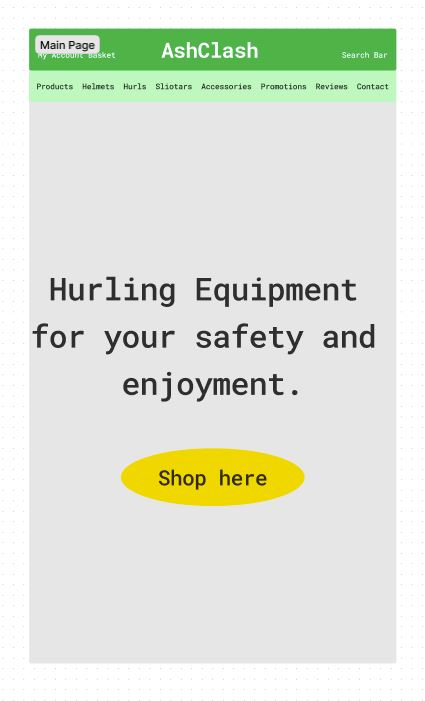

- Promotions Wireframe

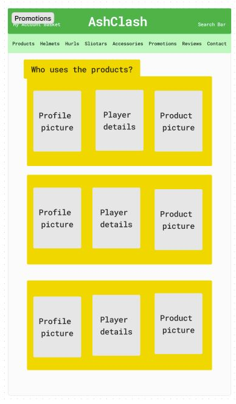

- Edit Promotions Wireframe

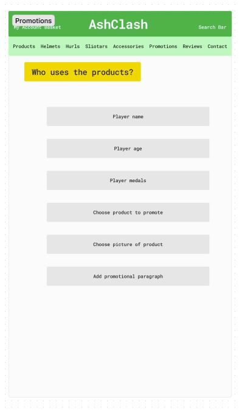

- Reviews Wireframe

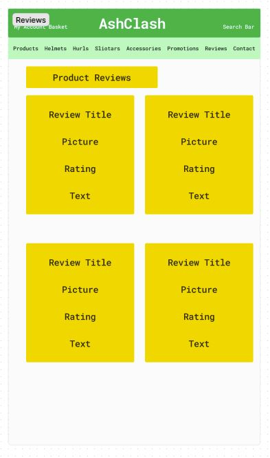

- Edit Reviews Wireframe

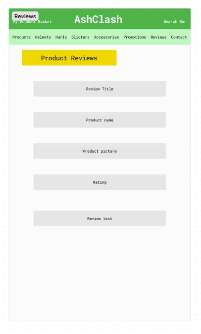

## Flow Diagram

Here is a diagram showing the possible flow through the site. There are 2 sections shown here. On the left it shows the Admin and the right shows a site user.

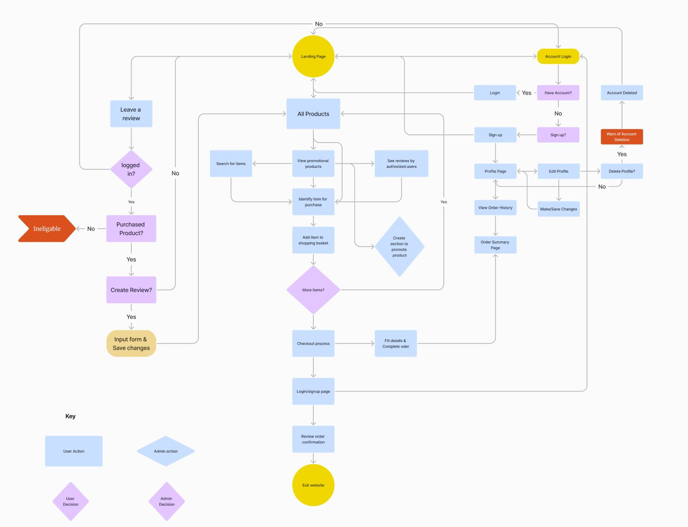

## Database Plan

The database plan is fairly simple, but it shows the information that is stored within the database, the type of data and if it is logged as a Primary or Foreign key where applicable.

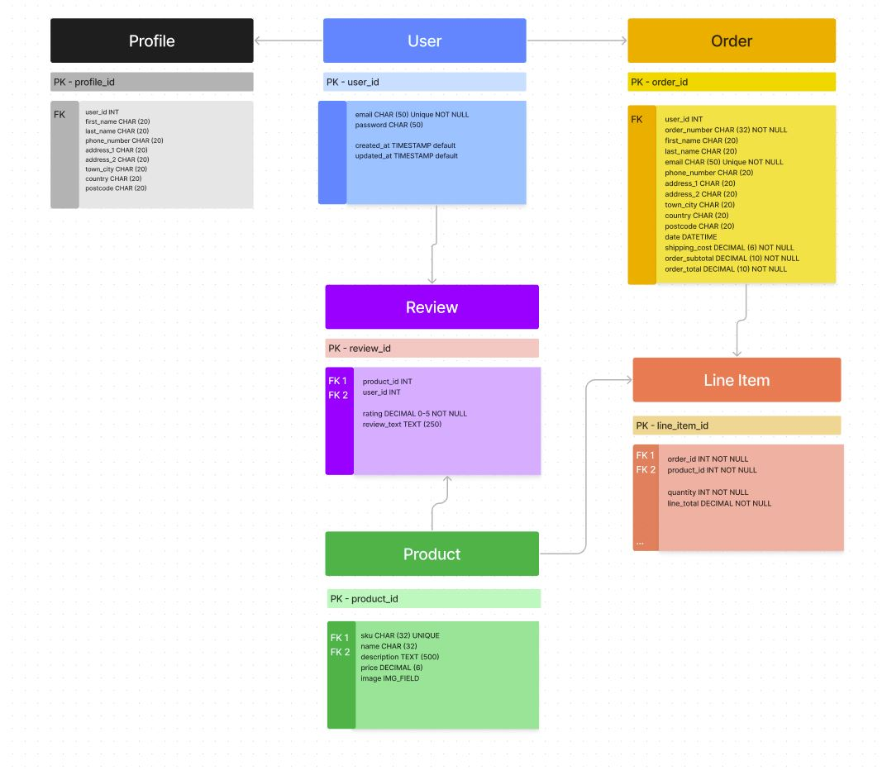

# Features

## Registration

The user can create an account

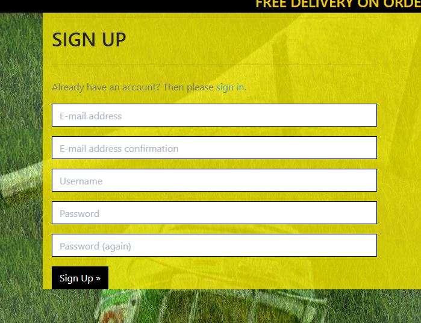

The user can logout of an account

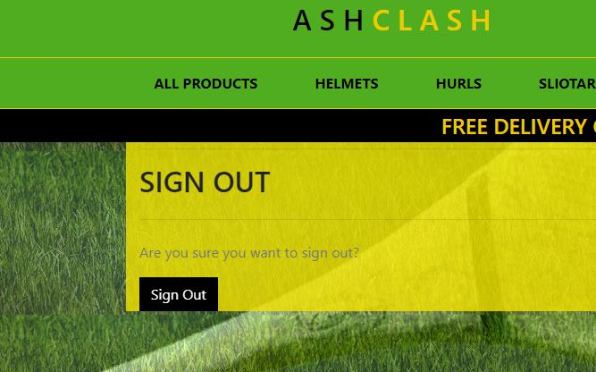

## Product Safety Feature

The user see if the product has a safety certificate.


## Product Availibility Feature

The user see if the product is availible.


## Promotions Feature

The admin can create a promotion of a product

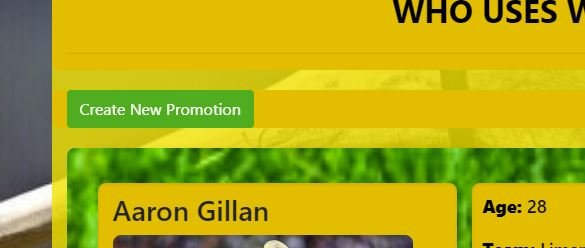

The admin can edit a promotion.

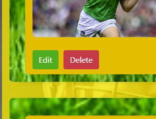

The admin can delete a promotion.


## Reviews Feature

The User can create a review of a product they purchased

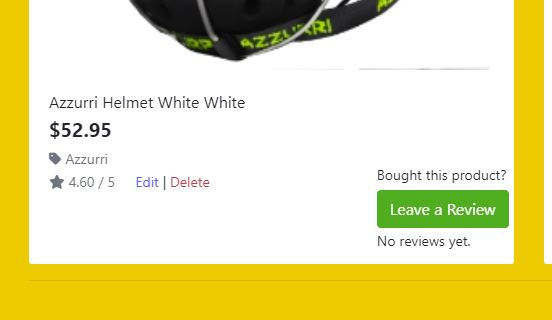

The user can edit a review they previously posted.

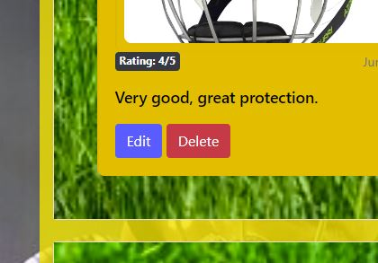

The user can delete a review they previously posted.


## Newsletter Feature

The User have the sites newsletter sent to their email.


## Features Not Implemented
- Displaying the count of reviews for the product.
Conditionally showing a message if there are no reviews ("No reviews yet").

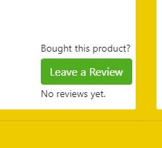

Reason for not implementing: Time Constraints and Model Setup Complexity

Implementing this feature required altering the database schema by modifying models to establish the relationship, running database migrations to update the schema, ensuring no data is lost or corrupted during this process, updating views to correctly fetch and count reviews this in turn required writing new logic to fetch and count reviews, ensuring this logic integrates seamlessly with existing views and modifying templates to display the review count.

While showing the count of reviews would enhance the user experience, the complexity and time required to implement it correctly and safely are substantial. Given the current project timeline and the potential for introducing instability, it is more prudent to postpone this feature to a future release when there is sufficient time to make these changes carefully and thoroughly.

## Future Features
- Enhanced Reviews and Ratings:
  Allow users to upload photos with their reviews.
  Implement review filtering and sorting options (e.g., by rating, date).
  Add a feature for users to mark reviews as helpful or report inappropriate reviews.

- Wishlist and Favorites:
  Allow users to create and manage wishlists.
  Provide a "favorite" button for easy access to frequently viewed products.

- Personalized User Dashboard:
  Create a user dashboard where customers can view order history, track shipments, and manage account details.
  Provide personalized offers and discounts based on purchase history.

- Loyalty Program:
  Implement a loyalty program to reward repeat customers with points, discounts, or special offers.

- Mobile App:
  Develop a mobile app for Android and iOS to provide a seamless shopping experience on the go.
  Implement push notifications for promotions and order updates.

- Blog and Content Marketing:
  Add a blog section to share articles, product guides, and company news.
  Integrate with social media platforms for content sharing.

- Enhanced Analytics and Reporting:
  Implement tools for tracking user behavior, sales trends, and marketing campaign effectiveness.
  Provide detailed reports for business insights and decision-making.


### Models

I created a number of models for my project. I used allauth's models for authentication. Here are the other models and their fields:

#### UserProfile Class (Profile Model)

| **PK** | **id** (unique)         | Type         | Notes                                          |
| ------ | ----------------------- | ------------ | ---------------------------------------------- |
| **FK** | user                    | OneToOne     | FK to **User** model                           |
|        | default_phone_number    | CharField    | max_length=20, null=True, blank=True           |
|        | default_street_address1 | CharField    | max_length=80, null=True, blank=True           |
|        | default_street_address2 | CharField    | max_length=80, null=True, blank=True           |
|        | default_town_or_city    | CharField    | max_length=40, null=True, blank=True           |
|        | default_county          | CharField    | max_length=80, null=True, blank=True           |
|        | default_postcode        | CharField    | max_length=20, null=True, blank=True           |
|        | default_country         | CountryField | blank_label='Country *', null=True, blank=True |

#### Order Class (Checkout Model)

| **PK** | **id** (unique) | Type         | Notes                                                                    |
| ------ | --------------- | ------------ | ------------------------------------------------------------------------ |
|        | order_number    | CharField    | max_length=32, null=False, editable=False                                |
| **FK** | user_profile    | ForeignKey   | FK to **UserProfile** model, null=True, blank=True, related_name='orders'|
|        | first_name      | CharField    | max_length=50, null=False, blank=False                                   |
|        | email           | EmailField   | max_length=254, null=False, blank=False                                  |
|        | phone_number    | CharField    | max_length=20, null=False, blank=False                                   |
|        | country         | CountryField | blank_label='Country *', null=False, blank=False                         |
|        | postcode        | CharField    | max_length=20, null=True, blank=True                                     |
|        | town_or_city    | CharField    | max_length=40, null=False, blank=False                                   |
|        | street_address1 | CharField    | max_length=80, null=False, blank=False                                   |
|        | street_address2 | CharField    | max_length=80, null=True, blank=True                                     |
|        | county          | CharField    | max_length=80, null=True, blank=True                                     |
|        | date            | DateTimeField| auto_now_add=True                                                        |
|        | delivery_cost   | DecimalField | max_digits=6, decimal_places=2, null=False, default=0                    |
|        | order_total     | DecimalField | max_digits=10, decimal_places=2, null=False, default=0                   |
|        | grand_total     | DecimalField | max_digits=10, decimal_places=2, null=False, default=0                   |
|        | original_basket | TextField    | null=False, blank=False, default=''                                      |
|        | stripe_pid      | CharField    | max_length=254, null=False, blank=False, default=''                      |

#### OrderLineItem Class (Checkout Model)

| **PK** | **id** (unique) | Type         | Notes                                                                      |
| ------ | --------------- | ------------ | -------------------------------------------------------------------------- |
| **FK** | order           | ForeignKey   | FK to **Order** model, null=False, blank=False, related_name='lineitems'   |
| **FK** | product         | ForeignKey   | FK to **Product** model, null=False, blank=False                           |
|        | product_size    | CharField    | max_length=50, null=True, blank=True                                       |
|        | quantity        | IntegerField | null=False, blank=False, default=0                                         |
|        | line_item_total | DecimalField | max_digits=6, decimal_places=2, null=False, blank=False, editable=False    |

#### Category Class (Product Model)

| **PK** | **id** (unique) | Type      | Notes                                 |
| ------ | --------------- | --------- | ------------------------------------- |
|        | name            | CharField | max_length=254                        |
|        | friendly_name   | CharField | max_length=254, null=True, blank=True |

#### Product Class (Product Model)

| **PK** | **id** (unique)     | Type           | Notes                                                                           |
| ------ | ------------------- | -------------- | ------------------------------------------------------------------------------- |
| **FK** | category            | ForeignKey     | FK to **Category** model, null=True, blank=True, on_delete=models.SET_NULL      |
|        | sku                 | CharField      | max_length=254, null=True, blank=True                                           |
|        | name                | CharField      | max_length=254                                                                  |
|        | description         | TextField      |                                                                                 |
|        | has_sizes           | BooleanField   | default=False, null=True, blank=True                                            |
|        | price               | DecimalField   | max_digits=6, decimal_places=2                                                  |
|        | image_url           | URLField       | max_length=1024, null=True, blank=True                                          |
|        | image               | CloudinaryField| blank=True, null=True                                                           |
|        | age_group           | CharField      | max_length=50, choices=AGE_GROUP_CHOICES, default='adult'                       |
|        | safety_certification| BooleanField   | default=False                       |
|        | availability        | BooleanField   | default=False                       |

#### PromotionalPlayer Class (Promotions Model)

| **PK**  | **id** (unique)    | Type           | Notes                                                    |
| ------- | ------------------ | -------------- | -------------------------------------------------------- |
| **FK**  | product            | ForeignKey     | Product, null=True, blank=True, on_delete=models.CASCADE |
|         | image              | CloudinaryField| 'image', blank=True, null=True                           |
|         | image_url          | URLField       | max_length=1024, null=True, blank=True                   |
|         | name               | CharField      | max_length=100                                           |
|         | age                | IntegerField   |                                                          |
|         | team               | CharField      | max_length=100                                           |
|         | medals             | TextField      |                                                          |
|         | product_to_promote | CharField      | max_length=100                                           |
|         | promotion_paragraph| TextField      |                                                          |

#### Review Class (Review Model)

| **PK** | **id** (unique) | Type          | Notes                                                                      |
| ------ | --------------- | ------------- | -------------------------------------------------------------------------- |
|        | user            | ForeignKey    | User, on_delete=models.CASCADE                                             |
| **FK** | product         | ForeignKey    | FK to **Product** model, null=False, blank=False, on_delete=models.CASCADE |
|        | title           | CharField     | max_length=200                                                             |
|        | text            | TextField     | max_length=400                                                             |
|        | rating          | IntegerField  |                                                                            |
|        | created_at      | DateTimeField | auto_now_add=True                                                          |
|        | updated_at      | DateTimeField | auto_now=True                                                              |

## Business Model

AshClash is dedicated to providing high-quality, specialized hurling equipment and accessories. Our product range includes hurls, helmets, sliotars, and various other accessories tailored to meet the unique needs of hurling players. We focus on quality, safety, and performance to ensure our customers receive the best gear available.

- Customers:
  Individual Players: Amateur and professional hurling players seeking reliable and durable equipment.
  Teams and Clubs: Local hurling teams and clubs in need of bulk purchases and customized gear.
  Schools and Academies: Educational institutions and training academies looking to equip their students with proper hurling equipment.
  Retailers and Distributors: Sports retailers and distributors interested in stocking high-quality hurling gear.

- Channels:
  Online Store: Our primary sales channel is the AshClash website, where customers can browse and purchase products directly.
  Social Media: We utilize platforms like Facebook, Instagram, and Twitter for marketing, customer engagement, and direct sales through integrated shopping features.
  Email Marketing: Regular newsletters and promotional emails to keep customers informed about new products, offers, and hurling news.
  Partnerships: Collaborations with local hurling clubs, schools, and sports retailers to expand our reach and presence.

- Relationships:
  Personalized Service: Offering expert advice and recommendations to customers to help them choose the right products.
  Customer Support: Providing responsive and helpful customer service through email, chat, and phone support.
  Community Engagement: Building a community of hurling enthusiasts through social media, forums, and sponsored events.

- Revenue:
  Direct Sales: Revenue from selling hurling equipment and accessories through our online store.
  Bulk Orders: Discounted bulk sales to teams, clubs, schools, and retailers.
  Customizations: Additional revenue from personalized and customized gear for teams and individuals.
  Affiliate Marketing: Commission from affiliate links and partnerships with other sports brands.

- Key Resources:
  Product Inventory: A wide range of high-quality hurling equipment and accessories.
  E-commerce Platform: A robust and user-friendly website for online sales.
  Supply Chain: Reliable suppliers and manufacturers to ensure product quality and availability.
  Marketing Tools: Social media, email marketing, and SEO strategies to drive traffic and sales.
  Customer Data: Insights and analytics to understand customer preferences and improve offerings.

- Activities:
  Product Sourcing: Continuously sourcing and updating our inventory with the latest and best hurling gear.
  Marketing and Promotion: Implementing effective marketing campaigns to attract and retain customers.
  Customer Service: Providing exceptional support and after-sales service to ensure customer satisfaction.
  Order Fulfillment: Efficiently managing inventory, packing, and shipping orders to customers.

- Partnerships:
  Suppliers and Manufacturers: Establishing strong relationships with reliable suppliers for quality products.
  Hurling Clubs and Associations: Partnering with clubs and associations for sponsorships and bulk sales.
  Marketing Affiliates: Collaborating with influencers, bloggers, and sports websites for affiliate marketing.
  Logistics Providers: Partnering with logistics companies for efficient order delivery.

- Cost Structure:
  Product Costs: Expenses related to sourcing and manufacturing hurling equipment and accessories.
  Operational Costs: Website maintenance, staff salaries, and office expenses.
  Marketing Expenses: Costs for digital marketing, advertising, and promotional activities.
  Shipping and Handling: Costs associated with packing and delivering orders to customers.
  Customer Service: Expenses for providing customer support and handling returns.

AshClash aims to become the go-to destination for hurling enthusiasts by offering a comprehensive range of high-quality equipment and accessories. By focusing on customer satisfaction, continuous product improvement, and effective marketing strategies, AshClash is poised to grow and thrive in the niche market of hurling sports.

### Search Engine Optimisation (SEO) and Marketing

#### Marketing

- Newsletter
The site has a number of features to help with SEO and marketing. The site has a promotions page, which allows famous hurling players to promote their favourite gear on the site that will help with SEO. You can [click here to access the promotions page](https://ashclash-pp5-8ef04402753f.herokuapp.com/promotions/promotions/). The promotion posts can be shared on social media to drive traffic to the site.

The site also has a Mailchimp newsletter signup form [Mailchimp](https://mailchimp.com/), which can be used to collect emails for marketing purposes. Newsletter form:

.

- Facebook page (rel attribute) 


The site also has a Facebook business page, which can be used to post content for customers to see, as well as engage with customers through comments and messages. You can [click here to see the AshClash Facebook Page](https://www.facebook.com/profile.php?id=61561113772755). Here is a screenshot of the Facebook Business Page:

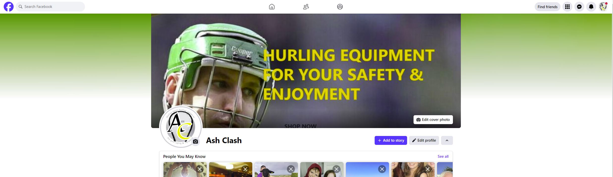

#### Keywords

The site has a number of keywords that are used in the content and meta tags to help with SEO. I used the tool [Ubersuggest](https://neilpatel.com/ubersuggest/) to find keywords. I used a combination of short-tail and long-tail keywords and included them in my meta tags. Here are some of the keywords I used:

Keywords 
- Hurling Equipment
- Hurling Gear
- High-Quality Hurling Gear
- Hurling Helmets
- Hurls
- Sliotars
- Hurling Accessories
- Ashguards
- Shinguards
- Protective Hurling Gear
- Best Hurling Gear
- Buy Hurling Equipment
- Online Hurling Shop
- Custom Hurling Gear
- Hurling Clubs Gear
- Hurling School Equipment
- Hurling Team Gear
- Hurling Gear for Kids
- Hurling Gear for Adults
- Professional Hurling Equipment
- Amateur Hurling Equipment
- Top Hurling Brands
- Affordable Hurling Gear
- Durable Hurling Equipment
- Hurling Training Gear
- Hurling Practice Gear
- Hurling Helmets Safety
- Hurling Sports Equipment
- Hurling Gear Discounts
- Premium Hurling Gear
- Hurling Equipment Reviews

While not all of these keywords are directly related to the products on the site, they are related to the theme of the site. This will help with SEO and driving traffic to the site.

#### Sitemap

I used [XML Siteamaps](https://www.xml-sitemaps.com/) to create a sitemap for the site. The sitemap is submitted to Google Search Console to help with SEO.

#### Robots.txt

I also added a robots.txt file to the site to help with SEO. The robots.txt file is used to tell search engines which pages to crawl and which to ignore. Here is the content of the robots.txt file:

```
User-agent: *
Disallow: /admin/
Disallow: /login/
Disallow: /user-profile/
Disallow: /checkout/
Disallow: /basket/
Disallow: /promotions/

User-agent: Googlebot
Allow: /

Sitemap: https://www.ashclash.com/sitemap.xml
```
___

# Technologies Used

Here are the technologies used to build this project:

- [Gitpod](https://gitpod.io/) To build and create this project
- [Github](https://github.com) To host and store the data for the site.
- [PEP8 Validator](https://pep8ci.herokuapp.com/) Used to check python code for errors
- [ElephandSQL](https://www.elephantsql.com/) Used to store PostgreSQL database.
- [Cloudinary](https://cloudinary.com/) Used as cloud storage for images uploaded as part of the blog posts
- [Heroku](https://id.heroku.com/) Used to deploy the project

# Programming Languages, Frameworks and Libraries Used

- [HTML](https://developer.mozilla.org/en-US/docs/Web/HTML)
- [CSS](https://developer.mozilla.org/en-US/docs/Learn/Getting_started_with_the_web/CSS_basics)
- [Python](https://en.wikipedia.org/wiki/Python_(programming_language))
- [Django](https://www.djangoproject.com/)
- [Bootstrap](https://getbootstrap.com/)
- [Stripe](https://docs.stripe.com/)

# Agile

This project was designed using Agile methodology, utilising the Project Board and Issues sections in GitHub

- [Project Board](https://github.com/users/Markyjay/projects/4)

## Testing documentation

I documented all automated and manual tests in the [TESTING.md](./TESTING.md) file.

# Deployment

## Github Deployment

The website was stored using GitHub for storage of data and version control. To do this I did the following;

After each addition, change or removal of code, in the terminal within your IDE (I used codeanywhere for this project) type:

- git add .
- git commit -m "meaningful commit message"
- git push

The files are now available to view within your github repository.

## Repository deployment via Heroku

- On the [Heroku Dashboard](https://dashboard.heroku.com) page, click New and then select Create New App from the drop-down menu.
- When the next page loads insert the App name and Choose a region. Then click 'Create app'
- In the settings tab click on Reveal Config Vars and add the key Port and the value 8000. The credentials for this app were:

1. Cloudinary URL (AWS would not accept my bank card so had to use cloudinary method from walkthrough p4)
2. Postgres Database URL
3. DISABLE_COLLECTSTATIC
4. Port (8000)
5. SECRET_KEY

- Below this click Add buildpack and choose python and nodejs in that order.

## Deployment of the app

- Click on the Deploy tab and select Github-Connect to Github.
- Enter the repository name and click Search.
- Choose the repository that holds the correct files and click Connect.
- A choice is offered between manual or automatic deployment whereby the app is updated when changes are pushed to GitHub.
- Once the deployment method has been chosen the app will be built and can be launched by clicking the Open app button which should appear below the build information window, alternatively, there is another button located in the top right of the page.
___

# Credits

This project was based on the Code Institute's - I think therefore I blog walkthrough module which provided a standard blog 'base'. From this base I customised a lot of the layout and styling with Bootstrap and custom CSS. I also added a custom model for booking a session. This allowed me to create a functionality within the site for users to filter through teachers and their reviews and comments selecting a suitable tutor if needed.

I also added several custom Views and Forms to the site, as well as ensuring that all links and desired functionality was working as intended.

For inspiration and fine-tuning of my code, I referred to John Elder's youtube channel [Codemy](https://www.youtube.com/@Codemycom) where I was able to get a better understanding of how to correctly create this type of product using Django and Bootstrap.

The wireframe mockups were created using [Figma](https://https://www.figma.com/)

Once complete, the readme file was passed through a spelling and grammar check via [Grammarly](https://www.grammarly.com/)

___

# Media

For placeholder images, I have used from the official sites 
- [Azzurri](https://azzurri.ie/) 
- [Atak](https://atak.ie/) 
- [Cooper](https://cooper.ie/) 
- [Mycro](https://mycrosport.com/) 
- [Curran Hurls](https://curranhurling.com/) 
- [Farrell Hurls](https://www.trinitygaels.ie/) 
- [Moran Hurls](https://moranhurleys.ie/) 
- [Maher Homemade Hurls](https://www.maherhandmadehurls.com/) 
- [Torpey Hurls](https://torpey.ie/) 
- [O'Meara Sliotars](https://www.omearasliotars.com/) 
- [Karakal Sliotars](https://karakal.ie/) 
- [Precision Shin Guards](https://precisiontraining.online/collections/shinguards) 

Various other product images and information was taken from these set of sites such as sliotars, grips, gear bags and ash guards.

The main image and the promotion images are all found through google image search.

___

# Acknowledgments and Thanks

I would like to express my deepest gratitude to the following individuals and groups who have been instrumental in the successful completion of this project:

Patricia Young - my mother, for her unwavering encouragement and patience throughout this journey.

My friends and family members - For their invaluable help with testing and support: Serena, Nicola, Ross, Helen, Conor, Paddy and my niece Ava.

Jubril - my mentor at Code Institute, for his patience and generosity with his time and knowledge.

Kyle Clow and Stephen Dawson - New friends and recent hackathon partners. Their encouragement and patience were crucial. A special thanks to Stephen, whose inspiration and generous guidance made a significant difference. Without his help, I would have felt lost.

Other Slack members and the Code Institute Tutoring service - For their helpful insights and support throughout the project.

Thank you all for your contributions and support.