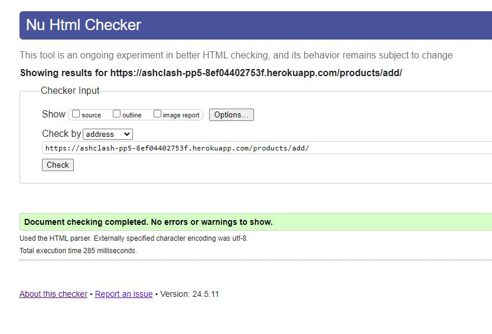
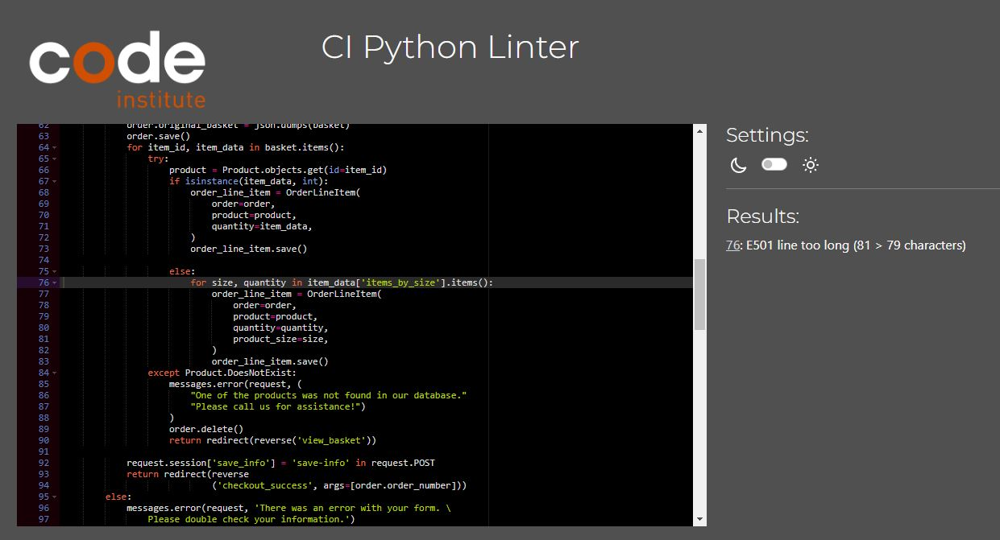
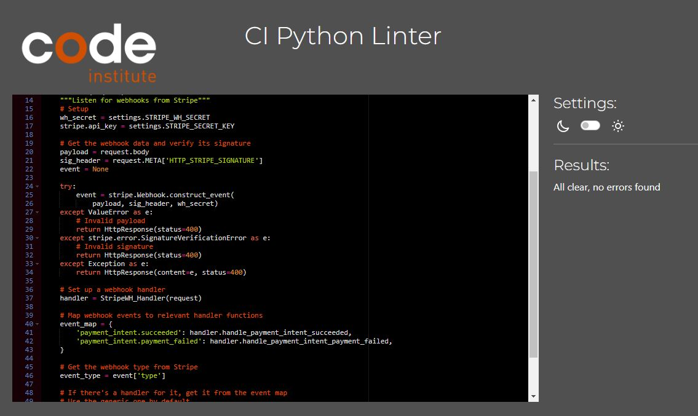
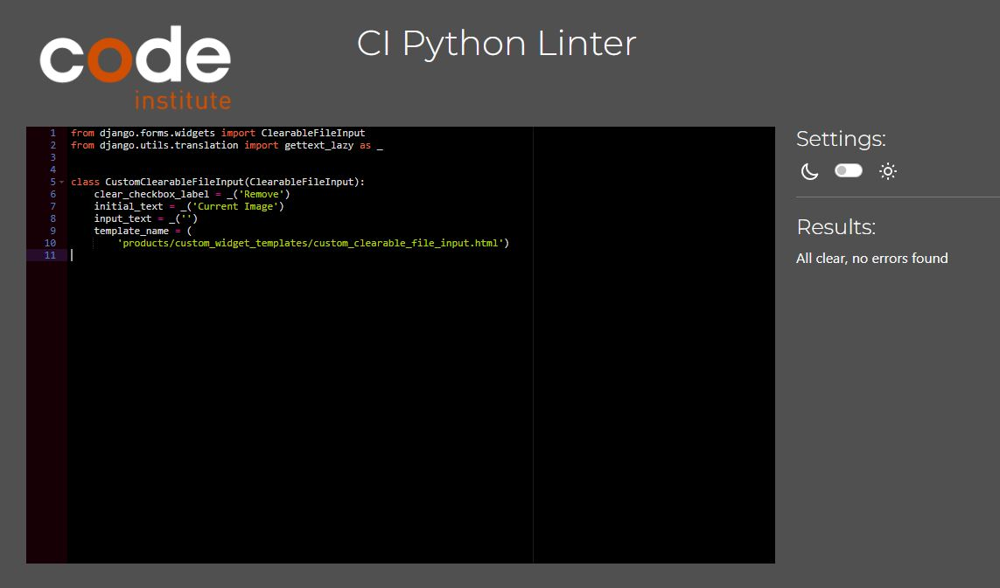
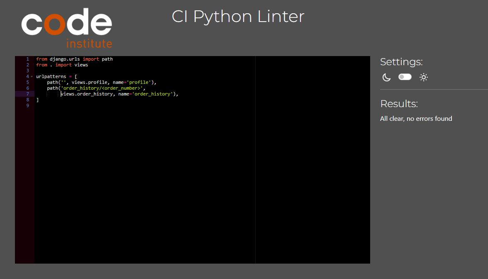

# Testing

[Click here to go back to the README.md file](README.md)

## Overview

This document outlines the testing process for the Sleep Healthily website. The testing process includes manual testing, performance testing and code validation. The testing process was carried out on Google Chrome, Mozilla Firefox, and Safari on MacBook.

## Table of Contents

- [Validation](#validation)
  - [HTML](#html)
  - [CSS](#css)
  - [JavaScript](#javascript)
  - [Python and Django (Pep 8)](#python-and-django-pep-8)
- [Performance](#performance)
  - [Mobile Performance](#mobile-performance)
  - [Desktop Performance](#desktop-performance)
- [Manual Testing](#manual-testing)
- [Incomplete known bugs and UX improvements](#incomplete-known-bugs-and-ux-improvements)

## Validation

### HTML

I use the [W3C Markup Validation Service](https://validator.w3.org/) to validate my HTML code.

With Django, there's a lot of syntax that doesn't play well with the HTML Validator, such as `` or `{{ variable|filter }}`.

Normally, I validate by using [validate by uri](https://validator.w3.org/#validate_by_uri) by passing in my deployed URL. However, many pages on this site require a user to be logged in and authenticated, and will not work using this method, due to the fact that the HTML Validator (W3C) doesn't have access to login to the pages.

In order to properly validate my HTML pages for authenticated pages, I followed these steps:

- Navigate to the deployed pages that require authentication
- Right-click anywhere on the page, and select **View Page Source** (usually `CTRL+U` or `⌘+U` on Mac).
- This will display the entire compiled code.
- Copy everything, and use the [validate by input](https://validator.w3.org/#validate_by_input) method.
- Repeat this process for every page that requires a user to be logged-in/authenticated.

| Page             | W3C URL                                                                                                 | Screenshot                                                                         | Notes                                                                 |
| ---------------- | --------------------------------------------------------------------------------------------------------------------------------------------------- | ---------------------------------------------------------------------------------- | --------------------------------------------------------------------- |
| Homepage         | [Link](https://validator.w3.org/nu/?doc=https%3A%2F%2Fashclash-pp5-8ef04402753f.herokuapp.com%2F)       |                  | Pass                                                                  |
| Products            | NA                                                                                                                                                  |                        | Pass                                                                  |
| Products Add         | NA                                                                                                                                                  |                  | Pass                 |
| Product Detail   | [Link](https://validator.w3.org/nu/?doc=https%3A%2F%2Fashclash-pp5-8ef04402753f.herokuapp.com%2Freview%2Fproducts%2F175%2F)                                 |      | Pass                                                                  |
| Profile        | NA                                                                                                                                                  |                | Pass                 |
| Promotions | [Link](https://validator.w3.org/nu/?doc=https%3A%2F%2Fashclash-pp5-8ef04402753f.herokuapp.com%2Fpromotions%2Fpromotions%2F)                                                  |  | Pass                                                                  |
| Create Promotions      | [Link](https://ashclash-pp5-8ef04402753f.herokuapp.com/promotions/promotions/create/)                                                   |              | Duplicate error ID when using Custom Clearable input from CI Tutorial                                                                 |
| Basket             | NA                                                                                                                                                  |                          | Pass                                                                  |
| Checkout         | [Link](https://validator.w3.org/nu/?doc=https%3A%2F%2Fashclash-pp5-8ef04402753f.herokuapp.com%2Fcheckout%2F)                                                |                    | Pass                                                                  |
| Edit Review     | NA                                                                                                                                                  |          | Duplicate error ID when using Custom Clearable input from CI Tutorial |
| Login            | [Link](https://validator.w3.org/nu/?doc=https%3A%2F%2Fashclash-pp5-8ef04402753f.herokuapp.com%2Faccounts%2Fsignup%2F)                                         |                        | Pass                                                                  |
| Logout   | [Link](https://validator.w3.org/nu/?doc=https%3A%2F%2Fashclash-pp5-8ef04402753f.herokuapp.com%2Faccounts%2Flogout%2F) |        | Scope error due to Bootstrap 4 syntax                                 |
| Signup           | [Link](https://validator.w3.org/nu/?doc=https%3A%2F%2Fashclash-pp5-8ef04402753f.herokuapp.com%2Faccounts%2Flogout%2F)                                        |                      | Pass                                                                  |

### CSS

I use the [W3C CSS Validation Service](https://jigsaw.w3.org/css-validator/) to validate my CSS code. You can [click here to see the validated CSS code without any errors](https://jigsaw.w3.org/css-validator/validator?uri=https%3A%2F%2Fashclash-pp5-8ef04402753f.herokuapp.com%2F&profile=css3svg&usermedium=all&warning=1&vextwarning=&lang=en).

### JavaScript

I used [JSHint](https://jshint.com/) to validate my JavaScript code. Here is a table of the validated code, which shows the file validated, a screenshot and a description of any warnings:

| File        | Screenshot                                                               | Description                                                                       |
| ----------- | ------------------------------------------------------------------------ | --------------------------------------------------------------------------------- |
| `script.js` |  | Optional chaining warning because online validator can't recognise I'm using ES11 |

### Python and Django (Pep 8)

I used the [Code Institute PEP8 Validator](https://pep8ci.herokuapp.com/) to check that my Python code is PEP8 compliant. I validated any files that were either modified or created by me. Here is a table of the validated code, which shows the file validated, a screenshot, and a description of any warnings:

| File                        | Screenshot                                                                              | Description                                                                                   |
| --------------------------- | --------------------------------------------------------------------------------------- | --------------------------------------------------------------------------------------------- |
| ashclash/settings.py |  | Pass |
| ashclash/urls.py     |          | Pass                                                                                          |
| basket/contexts.py            |                        | Pass                                                                                          |
| basket/views.py               |                                | 32: E501 line too long (82 > 79 characters)                                                 |
| basket/urls.py                |                                | Pass                                                                                          |
| checkout/admin.py           |                      | Pass                                                                                          |
| checkout/forms.py           |                      | Pass                                                                                          |
| checkout/models.py          |                    | 52: E501 line too long (102 > 79 characters)
54: E501 line too long (95 > 79 characters)                                                                                          |
| checkout/signals.py         |                  | Pass                                                                                          |
| checkout/urls.py            |                        | Pass                                                                                          |
| checkout/views.py           |                      | Pass                                                                                          |
| checkout/webhook_handler.py |  | Pass                                                                                          |
| checkout/webhooks.py        |                | Pass                                                                                          |
| product/admin.py            |                        | Pass                                                                                          |
| product/forms.py            |                        | Pass                                                                                          |
| product/models.py           |                      | Pass                                                                                          |
| product/urls.py             |                          | Pass                                                                                          |
| product/views.py            |                        | Pass                                                                                          |
| product/widgets.py          |                    | Pass                                                                                          |
| profiles/forms.py           |                      | Pass                                                                                          |
| profiles/models.py          |                    | Pass                                                                                          |
| profiles/urls.py            |                        | Pass                                                                                          |
| profiles/views.py           |                      | Pass                                                                                          |
| promotions/admin.py           |                      | Pass                                                                                          |
| promotions/forms.py               |                              | Pass                                                                                          |
| promotions/models.py              |                            | Pass                                                                                          |
| promotions/urls.py                |                                | Pass                                                                                          |
| promotions/views.py               |                              | Pass                                                                                          |
| home/urls.py                |                                | Pass                                                                                          |
| home/views.py               |                              | Pass                                                                                          |

| review/admin.py             |                          | Pass                                                                                          |
| review/forms.py             |                          | Pass                                                                                          |
| review/models.py            |                        | Pass                                                                                          |
| review/urls.py              |                            | Pass                                                                                          |
| review/views.py             |                          | Pass                                                                                          |

## Performance

Performance metrics were gathered using Google's PageSpeed Insights to ensure the website operates efficiently on both mobile and desktop devices. Below are the performance results with Lighthouse screenshots from the `documentation/performance` directory.

### Mobile Performance

| Page            | Lighthouse Screenshot                                                           | Comments                                                                                       |
| --------------- | ------------------------------------------------------------------------------- | ---------------------------------------------------------------------------------------------- |
| Homepage        |                |                                                                                                |
| Login           |                      |                                                                                                |
| Order Summary   |      |                                                                                                |
| Product Detail  |                  |                                                                                                |
| Products        |                |                                                                                                |
| Search          |                    |                                                                                                |
| Signup          |                    |                                                                                                |

### Desktop Performance

| Page            | Lighthouse Screenshot                                                             | Comments       |
| --------------- | --------------------------------------------------------------------------------- | -------------- |
| Homepage        |                |                |
| Login           |                      |                |
| Order Summary   |      |                |
| Privacy Policy  |    |                |
| Product Detail  |    |                |
| Products        |                |                |
| Search          |                    |                |
| Shipping Policy |  |                |
| Signup          |                    |                |

## Manual Testing

I carried out manual testing according to my user stories. To be considered a pass, it needs to have met the acceptance criteria. I carried the tests out on Google Chrome, Mozilla Firefox, and Safari on MacBook.

| User story - As an admin, I want to be able to...                                                                            | Notes  | Chrome | Firefox | Safari |
| ---------------------------------------------------------------------------------------------------------------------------- | ------ | :----: | :-----: | :----: |
| **monitor user profiles** to **maintain an accurate user database**.                                                         | Passed |   ✅   |   ✅   |   ✅   |
| **create new products** to **offer more choices to customers**.                                                              | Passed |   ✅   |   ✅   |   ✅   |
| **update product details** to **ensure all information about the products is current and accurate**.                         | Passed |   ✅   |   ✅   |   ✅   |
| **delete products** to **remove items that are no longer available or relevant**.                                            | Passed |   ✅   |   ✅   |   ✅   |
| **to view a list of all promotional player profiles** to **efficiently manage and monitor the product promotions**.          | Passed |   ✅   |   ✅   |   ✅   |
| **to add new player profiles** to **keep the player database current and complete**.                                         | Passed |   ✅   |   ✅   |   ✅   |
| **edit existing player profiles** to **update information as needed**.                                                       | Passed |   ✅   |   ✅   |   ✅   |
| **delete player profiles that are no longer active** to **to maintain a clean and updated player database**.                 | Passed |   ✅   |   ✅   |   ✅   |
| **monitor reviews left by customer** to **keep consider advice given by my consumers**.                                      | Passed |   ✅   |   ✅   |   ✅   |
| **delete reviews** to **keep them relevent and clean**.                                                                      | Passed |   ✅   |   ✅   |   ✅   |

| User story - As a user, I can...                                                                                             | Notes  | Chrome | Firefox | Safari |
| ---------------------------------------------------------------------------------------------------------------------------- | ------ | :----: | :-----: | :----: |
| **create an account** to **access personalised features and save my purchase history**.                                      | Passed |   ✅   |   ✅   |   ✅   |
| **log into my account** to **access my personal settings and order history, or prefill my details at checkout**.             | Passed |   ✅   |   ✅   |   ✅   |
| **log out of my account** to **ensure my account is secure when I'm not using it**.                                          | Passed |   ✅   |   ✅   |   ✅   |
| **access and view my user profile** to **see my personal information, order history, and manage my account settings**.       | Passed |   ✅   |   ✅   |   ✅   |
| **edit and delete my account** to **change or remove my personal data from the platform**.                                   | Passed |   ✅   |   ✅   |   ✅   |
| **search for products** to **find specific items I'm interested in purchasing**.                                             | Passed |   ✅   |   ✅   |   ✅   |
| **sort products by criteria** to **easily find what I'm looking for**.                                                       | Passed |   ✅   |   ✅   |   ✅   |
| **view product details** to **make informed purchase decision**.                                                             | Passed |   ✅   |   ✅   |   ✅   |
| **add products to my basket** to **purchase them**.                                                                          | Passed |   ✅   |   ✅   |   ✅   |
| **update or remove products from my basket** to **manage items before finalizing my purchase**.                              | Passed |   ✅   |   ✅   |   ✅   |
| **view a summary of my orders** to **keep track of my purchases**.                                                           | Passed |   ✅   |   ✅   |   ✅   |
| **complete the checkout process and pay** to **finalise my order**.                                                          | Passed |   ✅   |   ✅   |   ✅   |
| **create reviews for products** to **share my experience with others**.                                                      | Passed |   ✅   |   ✅   |   ✅   |
| **update my reviews** to **modify my feedback if my opinion changes**.                                                       | Passed |   ✅   |   ✅   |   ✅   |
| **delete my reviews** to **remove my feedback if I no longer wish it to be displayed**.                                      | Passed |   ✅   |   ✅   |   ✅   |

## Incomplete known bugs and UX improvements

The below are known bugs and possible areas of UX improvement I came across during testing.

1. 